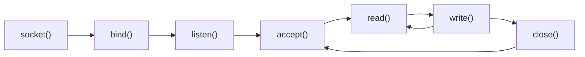
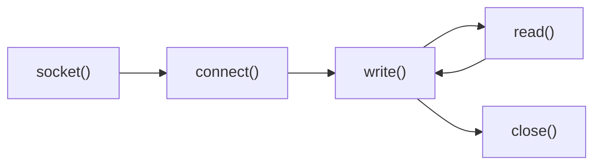

title: Building a Kafka Pet Project (Part 2)
date: 2026-03-17
description: In this part, we will review some concepts in network programming and build a simple echo program: Client ping and Server pong to learn how to read and write from TCP stream.
tags: Kafka, Architecture
series: Kafka Pet Project
series_title: Network programming
---


## Network programming

First step, we will find out how diffrent machine can comunicate together:

1. Machine A: Create a TCP server on "IP1" address and is ready for a connection
2. Machine B: Create a connection with TCP protocol on "IP1" address
3. A and B communicate (send and receive messages) via the established stream.


**Server side (Unix-like systems):**



**Client side (Unix-like systems):**



So first, let create a TCP client and server.

### 1. Zig

```zig
    pub fn startServer(io: Io) !void {
    const address = try Io.net.Ip4Address.parse("127.0.0.1", 1234);
    var server = try address.listen(io, .{ .mode = .stream, .protocol = .tcp, .reuse_address = true });
    const stream = try server.accept(io);
    }
```

-  First, we define an IP address "127.0.0.1" with the port 1234. 
- Then we create a server with TCP protocol and reuse_address option via listen function. (reuse_address help us use the port immediately without waiting TIME_OUT from OS)
- On calling server.accept(), the program will block until the server is connected.


### 2. Go

```go
func startServer() {
    listener, _ := net.Listen("tcp", ":1234")
    conn, _ := listener.Accept()
}
```


