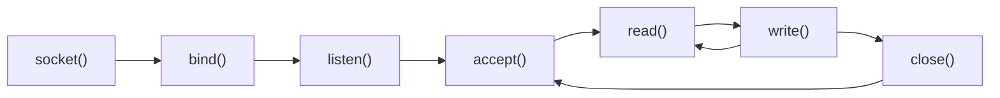
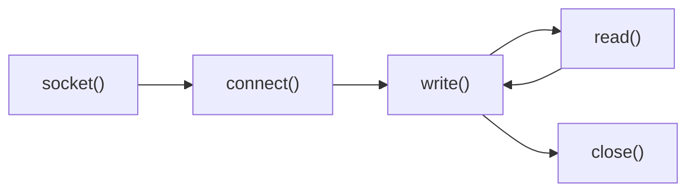

title: Building a Kafka Pet Project (Part 2)
date: 2026-03-20
description: In this part, we will review some concepts in network programming and build a simple echo program: Client ping and Server pong to learn how to read and write from TCP stream. This low-level TCP understanding will help us later when we design broker–client communication in Kafka.”
tags: Kafka, Architecture
series: Kafka Pet Project
series_title: Network programming
---


## Network programming

First step, we will find out how diffrent machine can comunicate together by implemeting a mini project: Client ping and Server pong.

1. Machine A: Create a TCP server on "IP1" address and is ready for a connection
2. Machine B: Create a connection with TCP protocol on "IP1" address
3. A and B communicate (send and receive messages) via the established stream.


**Server side (Unix-like systems):**



**Client side (Unix-like systems):**



###  Implement a TCP server and client

First, we define the requirements for this mini project. The goal is to illustrate communication between two machines over a TCP stream. We will:
- Create a TCP server that can listen for incoming connection and accept listening on a specific port (let's say 1234)
- Create a TCP client that can connect to the server on the same port (1234)


**Zig**

```zig
    // Server
    pub fn startServer(io: Io) !void {
        const address = try Io.net.Ip4Address.parse("127.0.0.1", 1234);
        var server = try address.listen(io, .{ .mode = .stream, .protocol = .tcp, .reuse_address = true });
        const stream = try server.accept(io);
    }

    // Client
    pub fn clientConnect(io: Io) !void {
        const address = try Io.net.IpAddress.parse("127.0.0.1", 1234);
        const connection = try address.connect(io, .{ .mode = .stream, .protocol = .tcp });
    }
```

First, we define an IP address "127.0.0.1" with the port 1234. 
Then we create a server with TCP protocol and `reuse_address` option via listen function. (reuse_address help us use the port immediately without waiting TIME_OUT from OS)
On calling `server.accept()`, the program will block until the server is connected.


**Go**

```go
// Server
func startServer() {
    listener, _ := net.Listen("tcp", ":1234")
    conn, _ := listener.Accept()
}

// Client
func clientConnect() {
    connection, _ := net.Dial("tcp", ":1234")
}
```

In Go, creating a TCP client and server is more straightforward using the `net` package. We only need `Listen()` and `Dial()`.

Similar to Zig, `Listen()` is blocking operation.

### Adding a start option

Since both client and server are implemented in the same program, we need a way to choose which mode to run

A simple solution is to use CLI arguments. For example, we can pass `client` and `server` as an argument to determine the execution mode  

**Zig**

```zig
pub fn main(init: std.process.Init) !void {
    // Prints to stderr, unbuffered, ignoring potential errors.
    std.debug.print("All your {s} are belong to us.\n", .{"codebase"});

    // This is appropriate for anything that lives as long as the process.
    const arena: std.mem.Allocator = init.arena.allocator();

    // Accessing command line arguments:
    const args = try init.minimal.args.toSlice(arena);
    for (args) |arg| {
        std.log.info("arg: {s}", .{arg});
    }

    // In order to do I/O operations need an `Io` instance. (Threaded)
    const io = init.io;

    // Check the second argument
    if (args.len > 1 and std.mem.eql(u8, args[1], "server")) {
        try startServer(io);
    } else {
        try clientConnect(io);
    }
}   
```
When we use `zig init` command to create the `main.zig` file, it already provides most of the `main()` structure. We only need to implement CLI argument checking by using `std.mem.eql()` since Zig represents string as bytes slices rather than a dedicated string type.


**Go**

```Go
func main() {

	if os.Args[1] == "server" {
		startServer()
	} else {
		clientConnect()
	}
}
```

